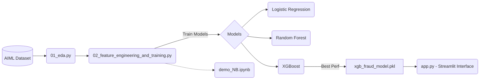

# 🛡️ Fraud Detection Machine Learning Pipeline

<p align="center">
  
  
  
  
</p>

This application focuses on exploratory data analysis (EDA) for fraud detection and evaluates the performance of different ML models, particularly **XGBoost**. It aims to uncover patterns that provide deeper insight into the characteristics of fraudulent financial transactions and deploy them in an interactive web application.

---

## 🏗️ Project Architecture



---

## 📂 Project Structure

| File / Module | Description | Phase |
|---|---|---|
| `demo_NB.ipynb` | Comprehensive Jupyter Notebook containing full EDA, feature engineering, and training workflow. | **All** |
| `01_eda.py` | Standalone Python script for data visualization and exploratory analysis. | **Phase 1** |
| `02_feature_engineering_and_training.py` | Standalone script for feature creation, scaling, and training (LogReg, RF, XGBoost). | **Phase 2** |
| `03_save_model.py` | Script covering the serialization of trained models and generating single predictions. | **Phase 3** |
| `app.py` | **Streamlit Web Application** providing a premium UI for real-time fraud predictions. | **Deployment** |
| `AIML Dataset.csv` | The raw transactional dataset (must be placed in root directory). | **Data** |

---

## 🚀 Getting Started

### 1️⃣ Setup Environment
Make sure you have all required Python packages installed:

```bash
pip install -r requirements.txt
```

> **Warning:** Ensure that the dataset `AIML Dataset.csv` is present in the root directory before running the data processing scripts or notebook.

### 2️⃣ Run the Web Application
To launch the Fraud Detection AI web interface, run the following command in your terminal:

```bash
streamlit run app.py
```
This will open the application in your default web browser where you can input transaction details and receive real-time fraud predictions using the trained XGBoost model.

---

## 🧪 Test Samples (Try these in the app!)

To see the model in action, try inputting these values in the Web App:

### 🚨 Fraudulent Transfer Example (Should be FRAUD):
- **Transaction Type**: `TRANSFER`
- **Amount**: `179,929.00`
- **Sender Old Balance**: `179,929.00`
- **Sender New Balance**: `0.00`
- **Recipient Old Balance**: `0.00`
- **Recipient New Balance**: `0.00`
> *Classic fraud pattern: Sender balance entirely drained, while recipient balance doesn't increase.*

### ✅ Normal Payment Example (Should be APPROVED):
- **Transaction Type**: `PAYMENT`
- **Amount**: `200.00`
- **Sender Old Balance**: `5,000.00`
- **Sender New Balance**: `4,800.00`
- **Recipient Old Balance**: `1,000.00`
- **Recipient New Balance**: `1,200.00`
> *Safe transaction pattern: Typical payment behavior with balances resolving correctly.*
